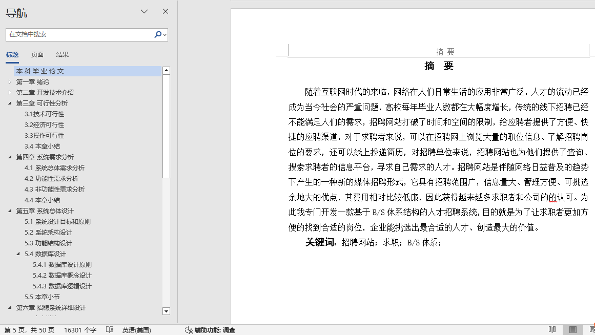

## 基于SSM框架的求职招聘系统(程序+报告)

###  获取sql数据库文件: 从戎源码网 (https://armycodes.com/) QQ: 386869957 QQ群: 377586148
###  所有系统地址: (https://github.com/YuLin-Coder/AllProjectCatalog) 
###  所有项目以及源代码本人均调试运行无问题 可支持远程安装部署调试、定制修改、代码讲解

## 项目介绍
基于SSM框架的求职招聘系统，系统分为三个角色：求职者、企业、平台管理员，主要功能如下

求职者可以发布简历，查看招聘信息，简历管理，面试管理，个人信息管理，注册登录。
公司管理员可以进行公司信息管理，发布招聘信息，查看简历，邀约面试，通知面试结果等信息。
平台管理员可以进行简历管理，公司信息管理，用户管理，动态管理等功能。

## 项目技术
- 编程语言：Java
- 数据库：MySQL
- 前端技术：JSP、Layui、Jquery
- 后端技术：Spring、SpringMVC、MyBatis

## 运行环境
- JDK版本：JDK1.8及以上
- 开发工具：IDEA、Ecplise、Myecplise都可以
- 数据库: MySQL5.7及以上

## 运行截图

